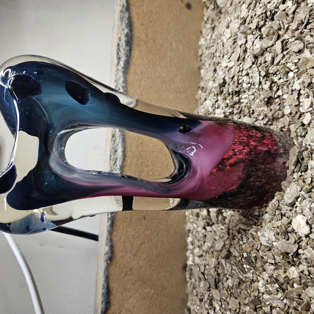
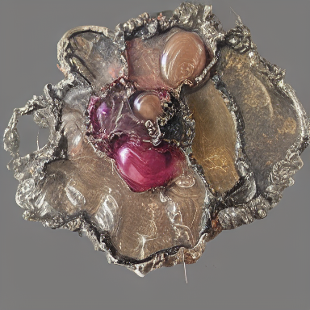

# extern_ai - LoRA Training for Visual Style

A project for training a LoRA (Low-Rank Adaptation) that captures an artistic visual aesthetic and applies it to image generation.

## Example: Training Data vs Generated Output

| Training Image | Generated Image |
|----------------|-----------------|
|  |  |

The model learns visual patterns from the training data and generates new images that capture the same aesthetic.

## Dataset Characteristics

This LoRA was trained on a **highly heterogeneous dataset** of approximately **5900 images** spanning:
- Multiple materials (glass, metal, textile, ceramic, mixed media)
- Various scales (jewelry to large sculptures)
- Different time periods and artistic phases
- Diverse documentation contexts (studio, exhibition, outdoor)

This heterogeneity is intentional: rather than training on a narrow, consistent style, the model learns a broader "visual fingerprint" that encompasses the full range of the artist's practice.

## Project Overview

This project uses machine learning to:
1. Analyze an image archive and extract visual style
2. Train a LoRA adapter that learns this style
3. Generate new images combining the learned style with text descriptions

## How Images Are Created

### Step 1: Dataset Preparation
Original images are prepared through:
- Conversion to 256x256 pixels
- Creation of text descriptions (captions) for each image
- Captions follow the format: `a photo of [trigger_word], [material], [object]`

### Step 2: LoRA Training
A LoRA is trained on the dataset. LoRA modifies only a small part of the base model's weights (approximately 1-2%), making it possible to learn a specific style without affecting the model's fundamental capabilities.

**Training Process:**
1. Images are encoded to "latent space" via VAE (Variational Autoencoder)
2. Latents are cached to disk for memory efficiency
3. UNet is trained with LoRA adapters on attention layers
4. The model learns to associate the trigger word with the visual style

### Step 3: Image Generation
New images are generated through:
1. Text prompt is written with the trigger word
2. Text is encoded via CLIP
3. Diffusion process: noise is gradually "cleaned" into an image
4. LoRA weights influence how noise is interpreted, producing the learned style

## What Is "My" Contribution vs "External AI"

### Artist's Contribution (Training Data)
- **Visual Aesthetic**: Color palettes, composition, material choices
- **Subject Matter**: Types of objects and forms present
- **Style**: Unique combination of the above

### External AI's Contribution (Base Model)
- **Fundamental Image Understanding**: Stable Diffusion was trained on billions of images
- **Language Understanding**: The CLIP model understands text descriptions
- **Technical Rendering**: How light, shadows, and textures are rendered

### The Combination
The finished image is a **fusion** where:
- The base model contributes technical competence and general image knowledge
- The LoRA steers the style toward the training data's aesthetic
- The prompt controls the subject and details

## Technical Specification

### Training Parameters

| Parameter | Value | Explanation |
|-----------|-------|-------------|
| Base Model | Stable Diffusion 1.5 | Diffusion model trained by Stability AI |
| LoRA rank | 64 | Number of dimensions in LoRA adapter |
| LoRA alpha | 32 | Scaling factor for LoRA weights |
| Epochs | 50 | Number of passes through the dataset |
| Learning rate | 1e-4 | Learning rate |
| Batch size | 1 | Images per training step |
| Gradient accumulation | 8 | Accumulated gradients before update |
| Image size | 256x256 | Training image resolution |
| Optimizer | AdamW | Optimization algorithm |
| Scheduler | Cosine | Learning rate schedule |

### Generation Parameters

| Parameter | Value | Explanation |
|-----------|-------|-------------|
| Inference steps | 25-30 | Number of diffusion steps |
| Guidance scale | 7.5 | How strictly the prompt is followed |
| Output size | 384x384 or 512x512 | Generated image size |
| Scheduler | DPMSolver++ | Faster sampling algorithm |

## File Structure

```
extern_ai/
├── README.md                    # This file
├── DEPENDENCIES.md              # External dependencies
├── scripts/
│   ├── prepare_dataset.py       # Dataset preparation
│   ├── train_lora.py            # Training script
│   ├── generate_images.py       # Basic generation script
│   ├── generate_100_random.py   # Structured random generation
│   └── generate_simple.py       # Minimal prompt generation
├── examples/
│   ├── dataset_sample/          # Examples from training data
│   ├── generated/               # Structured generation examples
│   └── generated_simple/        # Minimal prompt examples (showing drift behavior)
├── docs/
│   ├── training_process.md      # Technical training details
│   ├── generation_guide.md      # Generation strategies
│   └── artistic_rationale.md    # Why these settings matter artistically
└── config/
    └── training_config.yaml     # Configuration template
```

## Usage

### Prerequisites
```bash
# Create virtual environment
python3 -m venv venv
source venv/bin/activate

# Install dependencies
pip install -r requirements.txt
```

### Train LoRA
```bash
python scripts/train_lora.py \
    --dataset_path /path/to/dataset \
    --output_dir /path/to/output \
    --epochs 50 \
    --rank 64 \
    --lr 1e-4
```

### Generate Images

**Simple generation (minimal prompting):**
```bash
python scripts/generate_simple.py \
    --checkpoint ./checkpoints/epoch_050 \
    --output ./output \
    --count 10 \
    --token your_trigger_word
```

**Structured generation (material/object combinations):**
```bash
python scripts/generate_100_random.py \
    --checkpoint ./checkpoints/epoch_050 \
    --output ./output \
    --token your_trigger_word
```

## Reproducing Results

To reproduce this workflow with your own dataset:

1. Prepare 500-5000 images of consistent style
2. Run `prepare_dataset.py` to create captions
3. Train using `train_lora.py`
4. Generate with `generate_simple.py` or `generate_100_random.py`
5. Evaluate outputs against your training data

## License and Attribution

- The base model (Stable Diffusion 1.5) is licensed under CreativeML Open RAIL-M
- The LoRA training method is based on research by Microsoft and Hugging Face
- Training data and resulting LoRA weights belong to the artist

## Ethical Considerations

- This LoRA is trained on the artist's own material
- Generated images should not be presented as original works without clear marking
- The technology is a tool for artistic exploration, not a replacement for human creativity
